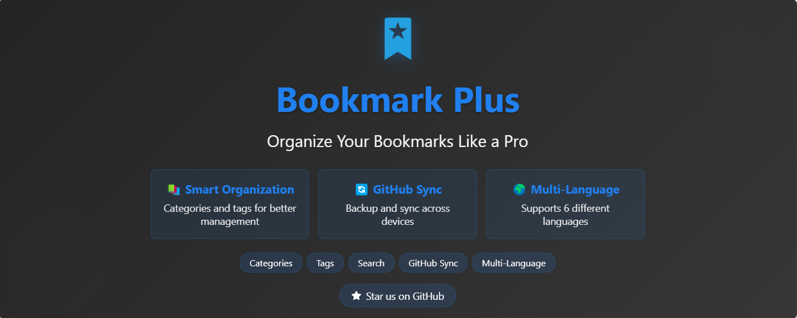

# 书签增强 (Bookmark Plus)

  

  <h3>🚀 智能的 Chrome 书签管理工具</h3>

  
  
  
  
  

  <a href="README.md">English</a> | <a href="README_zh.md">中文</a>

---

### ✨ 特色功能

- **智能管理**
  - 直观的书签分类管理
  - 灵活的标签系统
  - 快速搜索和筛选

- **GitHub 集成**
  - 一键上传书签至 GitHub 仓库
  - 手动备份到 GitHub 仓库
  - 安全的令牌认证

- **用户体验**
  - 清新现代的界面
  - 支持14种语言
  - 可自定义设置

  

### 🚀 快速开始

1. 从 [Releases](https://github.com/shalom-lab/bookmark-plus/releases/latest) 下载最新版本
2. 解压下载的文件
3. 访问 `chrome://extensions/`
4. 在右上角开启"开发者模式"
5. 点击"加载已解压的扩展程序"并选择解压后的文件夹
6. 点击扩展图标打开（或使用快捷键 `Alt+Q`）
7. 开始整理您的书签
8. （可选）配置 GitHub 同步

### 🔧 配置说明

#### GitHub 同步设置
1. 生成 GitHub 个人访问令牌
2. 在扩展设置中输入令牌
3. 选择您的仓库
4. 设置存储路径
5. 点击上传备份书签

#### 语言设置
- 支持：英语、中文、日语、韩语、法语、德语、西班牙语、葡萄牙语、意大利语、俄语、荷兰语、土耳其语、越南语、印尼语
- 在设置中更改语言

### 🤝 参与贡献

欢迎参与项目建设：
- 为项目点亮星标
- 提交问题反馈
- 创建拉取请求
- 分享使用体验

---

  Built with ❤️ by <a href="https://github.com/shalom-lab">Shalom Lab</a>

 